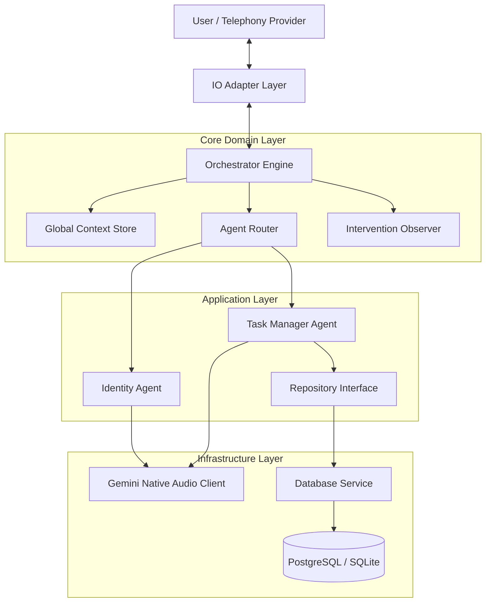

# System Architecture Specification

**Project:** Kura-Next Voice Agent Framework  
**Version:** 1.0.0  
**Document Type:** Engineering Specification

---

## 1. Executive Summary

Kura-Next is an enterprise-grade, event-driven framework designed for orchestrating stateful, multi-modal AI agents. The system leverages Google Gemini 2.5 Flash Native Audio capabilities to provide low-latency, bidirectional voice interactions. The architecture adheres to the **Hexagonal Architecture (Ports and Adapters)** pattern, ensuring strict separation between the core domain logic, external infrastructure, and user interfaces.

This framework is engineered to demonstrate senior-level software engineering capabilities, specifically in the areas of asynchronous concurrency, state management, and robust system design.

---

## 2. Architectural Design Principles

### 2.1. Hexagonal Architecture
The system is organized into concentric layers:
- **Domain Core**: Contains business logic, agent definitions, and state management (Context). It has no dependencies on external frameworks.
- **Ports (Interfaces)**: Defines abstract base classes for Input/Output (IOHandler) and Data Access (Repositories).
- **Adapters (Infrastructure)**: Implements the ports. Examples include `GeminiAudioClient`, `TwilioMediaStreamHandler`, and `SQLAlchemy` repositories.

### 2.2. Event-Driven Orchestration
The core runtime is built around an asynchronous event loop (`Orchestrator`) that processes a stream of `Signals`. This decoupled design allows for:
- Non-blocking I/O operations.
- Real-time intervention (interruption) handling.
- Pluggable input sources (CLI, WebSocket, Telephony).

### 2.3. Separation of Concerns
- **Orchestrator**: Manages the lifecycle and routing of signals.
- **Agents**: Encapsulate specific domain logic and tool definitions.
- **Observer**: Monitors the data stream passively for hotwords or sentiment spikes.

---

## 3. High-Level Architecture

---

## 4. Component Specification

### 4.1. Core Framework (`src/framework/core`)

#### A. The Orchestrator
The `Orchestrator` serves as the kernel of the application. It runs the primary `asyncio` event loop, consuming `Signal` objects from the `IOHandler`. It is responsible for:
1.  **Signal Routing**: Directing input to the active `AbstractAgent`.
2.  **Tool Execution**: intercepting tool calls and executing them via the `Tool` registry.
3.  **Latency Management**: Triggering filler audio during high-latency operations.

#### B. Context Management
State is managed hierarchically to ensure data consistency and isolation:
- **GlobalContext**: Application-level configuration.
- **SessionContext**: Ephemeral state for the current conversation flow.
- **UserContext**: Persisted identity and preferences for the authenticated user.

#### C. Intervention Observer
A background task that runs concurrently with the active agent. It analyzes the input stream for "hotwords" (e.g., "Stop", "Cancel") or negative sentiment spikes. Upon detection, it raises a `PriorityIntervention` exception, forcing the Orchestrator to preempt the current agent.

### 4.2. Infrastructure Layer (`src/infrastructure`)

#### A. Gemini Audio Client
Implements the `LLMProvider` interface. It manages a persistent WebSocket connection to the Google Gemini 2.5 Flash model. It handles:
- Serialization of PCM audio data.
- Function calling (Tool) definitions and response parsing.
- Session persistence across multiple turns.

#### B. Database Service
Implements the **Repository Pattern** using SQLAlchemy. This abstracts the underlying SQL syntax from the application layer, allowing for easy switching between SQLite (dev) and PostgreSQL (prod).

---

## 5. Voice User Interface (VUI) Mechanics

To ensure a natural user experience, the framework implements several VUI-specific optimizations:

### 5.1. Latency Masking
When an agent executes a tool marked as `is_slow=True` (e.g., database queries), the IO Handler immediately plays "filler" audio (e.g., "Let me check that for you..."). This reduces the perceived latency.

### 5.2. Warm Handoffs
When routing between agents (e.g., from Identity to Task Manager), the `HandoffData` object conveys the conversation context. This allows the target agent to resume the interaction seamlessly without asking the user to repeat information.

### 5.3. Interruption Handling
The system supports full-duplex audio. If the user speaks while the agent is responding, the `InterventionObserver` detects speech activity and halts audio output immediately.

---

## 6. Data Model

### 6.1. Entity Relationship Diagram

**Users Table**
- `user_id` (PK): UUID
- `phone_number`: Unique E.164 formatted string
- `full_name`: String
- `voice_preferences`: JSONB configuration

**Tasks Table**
- `task_id` (PK): UUID
- `user_id` (FK): Reference to Users
- `description`: Text
- `priority`: Integer (1-5)
- `status`: Enum (OPEN, IN_PROGRESS, COMPLETED, CANCELLED)
- `due_date`: DateTime

---

## 7. Technology Stack

- **Runtime**: Python 3.11+
- **AI Model**: Google Gemini 2.5 Flash (Native Audio)
- **Telephony**: Twilio Media Streams (WebSocket)
- **Server**: FastAPI / Uvicorn
- **Database**: SQLAlchemy (AsyncIO) with PostgreSQL/SQLite
- **Concurrency**: Python `asyncio`
